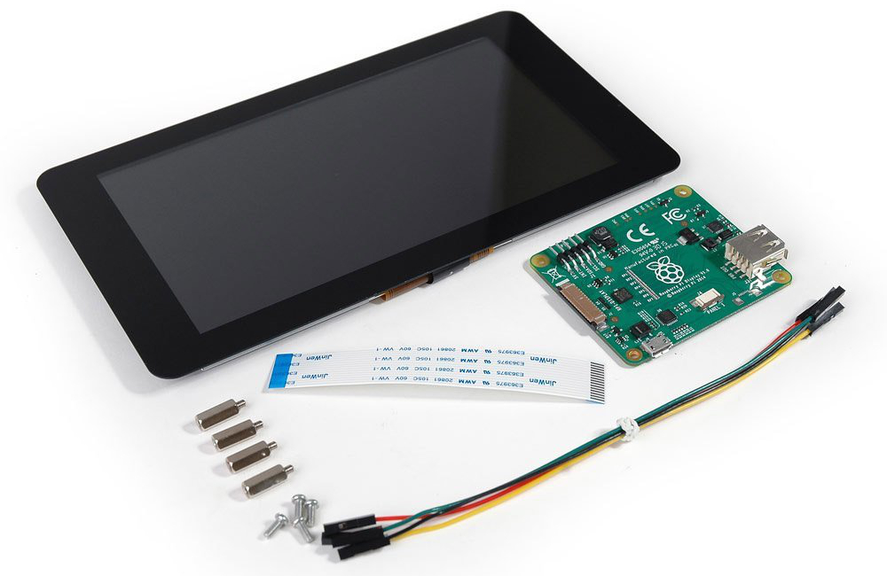

Home Automation
===============

Rasberry PI Setup
-----------------

### Touchscreen

To connect the Raspberry PI 7" Touchscreen look at this guide [here](https://thepihut.com/blogs/raspberry-pi-tutorials/45295044-raspberry-pi-7-touch-screen-assembly-guide).
This makes use of pins on the PI and touchscreen driver.

Altervatively you can use a USB cable to connect touchscreen and PI.

If you need to rotate the touchscreen edit `/boot/config.txt` and add this line: `lcd_rotate=2`.   
You need to have `sudo` access to edit the file.

### Radio Frequency Transmitter/Receiver

### Case

### RF Outlets
