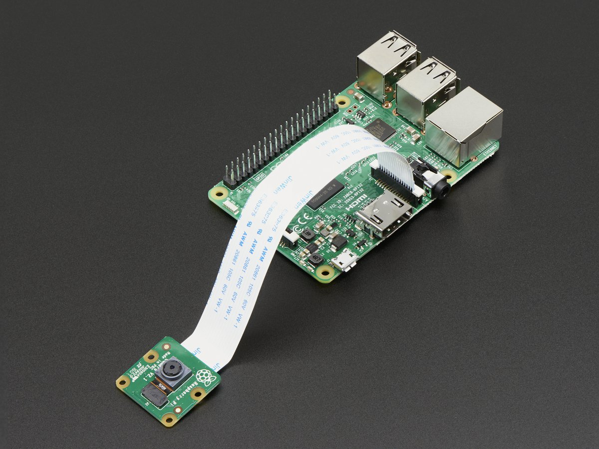

How to install / use the Raspberry Pi Camera
============================================

Hardware Setup
--------------

Connect the cable as seen below:



Software Setup
--------------

It might be necessary to do some updates:
```
sudo apt-get update
sudo apt-get upgrade
```
### Enable camera

Enable camera interface from the configuration:
```
sudo raspi-config
```
Select `5 Interfacing Options` and `P1 Camera` and enable it.
Then you can close the screen and reboot PI.

### Command-line interface

#### Taking a photo
Capture an image in jpeg format with default settings:
```
raspistill -o image.jpg
```

#### Recording a video
Capturing a 10 second video (10000 milliseconds).
```
raspivid -o video.h264 -t 10000
```
Capture 30 seconds of raw video at 640x480 and 150kB/s bit rate into a video.h264 file:
```
raspivid -t 30000 -w 640 -h 480 -fps 25 -b 1200000 -p 0,0,640,480 -o video.h264
```
The Pi captures video as a raw H264 video stream. Many media players will refuse to play it, or play it at an incorrect speed, unless it is "wrapped" in a suitable container format like MP4. The easiest way to obtain an MP4 file from the raspivid command is using MP4Box.

Install MP4Box with this command:
```
sudo apt-get install -y gpac
```
Capture your raw video with raspivid and wrap it in an MP4 container like this:
```
# Capture 30 seconds of raw video at 640x480 and 150kB/s bit rate into a pivideo.h264 file:
raspivid -t 30000 -w 640 -h 480 -fps 25 -b 1200000 -p 0,0,640,480 -o pivideo.h264
# Wrap the raw video with an MP4 container:
MP4Box -add pivideo.h264 pivideo.mp4
# Remove the source raw file, leaving the remaining pivideo.mp4 file to play
rm pivideo.h264
```
To play the video you can use omxplayer:
```
omxplayer video.mp4
```
[Source](https://thepihut.com/blogs/raspberry-pi-tutorials/16021420-how-to-install-use-the-raspberry-pi-camera)

[raspivid](https://www.raspberrypi.org/documentation/usage/camera/raspicam/raspivid.md)

### Python (picamera)

Install `picamera`:

- Python 2:
```
sudo apt-get install python-picamera
```

- Python 3:
```
sudo apt-get install python3-picamera
```
#### Examples

**Take a picture:**
```
import picamera

camera = picamera.PiCamera()
camera.capture('image1.jpg')
```

**Stop motion**
```
import picamera
from time import sleep

camera = picamera.PiCamera()

camera.capture('image1.jpg')
sleep(5)
camera.capture('image2.jpg')
```

**Video recording:**

```
import picamera
from time import sleep

camera.start_recording('video.h264')
sleep(5)
camera.stop_recording()
```

**Camera Settings:**

```
camera.sharpness = 0
camera.contrast = 0
camera.brightness = 50
camera.saturation = 0
camera.ISO = 0
camera.video_stabilization = False
camera.exposure_compensation = 0
camera.exposure_mode = 'auto'
camera.meter_mode = 'average'
camera.awb_mode = 'auto'
camera.image_effect = 'none'
camera.color_effects = None
camera.rotation = 0
camera.hflip = False
camera.vflip = False
camera.crop = (0.0, 0.0, 1.0, 1.0)
```

**Preview:**

You can display a preview showing the camera feed on screen. Warning: this will overlay your Python session by default; if you have trouble stopping the preview, simply pressing `Ctrl+D` to terminate the Python session is usually enough to restore the display:

```
camera.start_preview()
```

You can use the stop_preview method to remove the preview overlay and restore the display:

```
camera.stop_preview()
```

[Source](https://www.raspberrypi.org/documentation/usage/camera/python/README.md)
