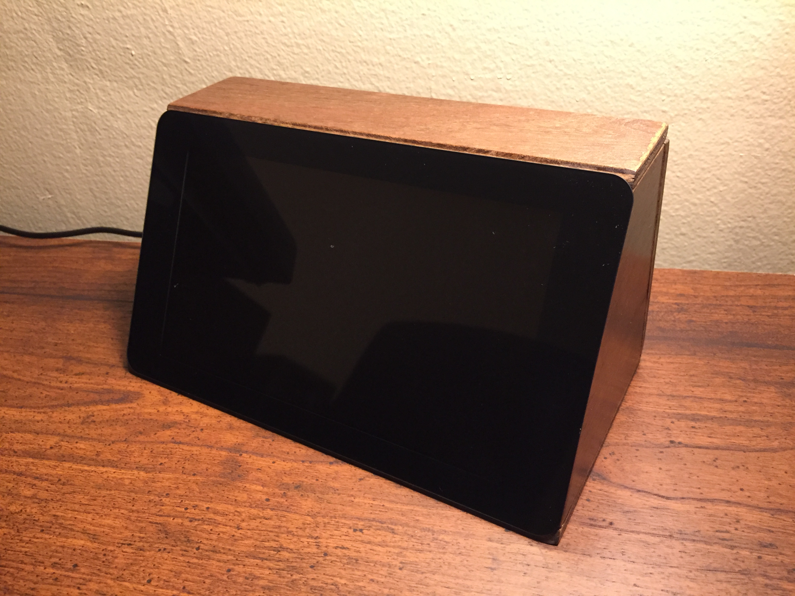
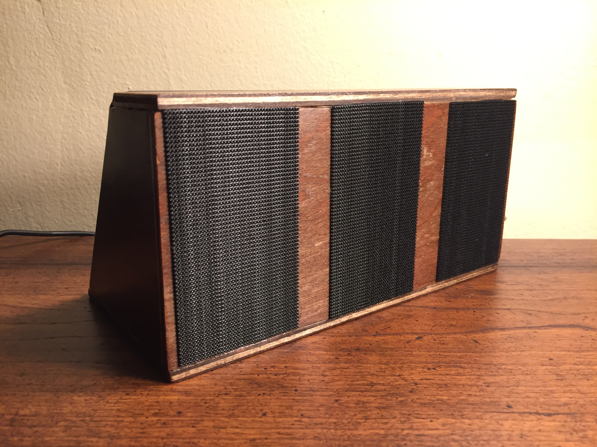
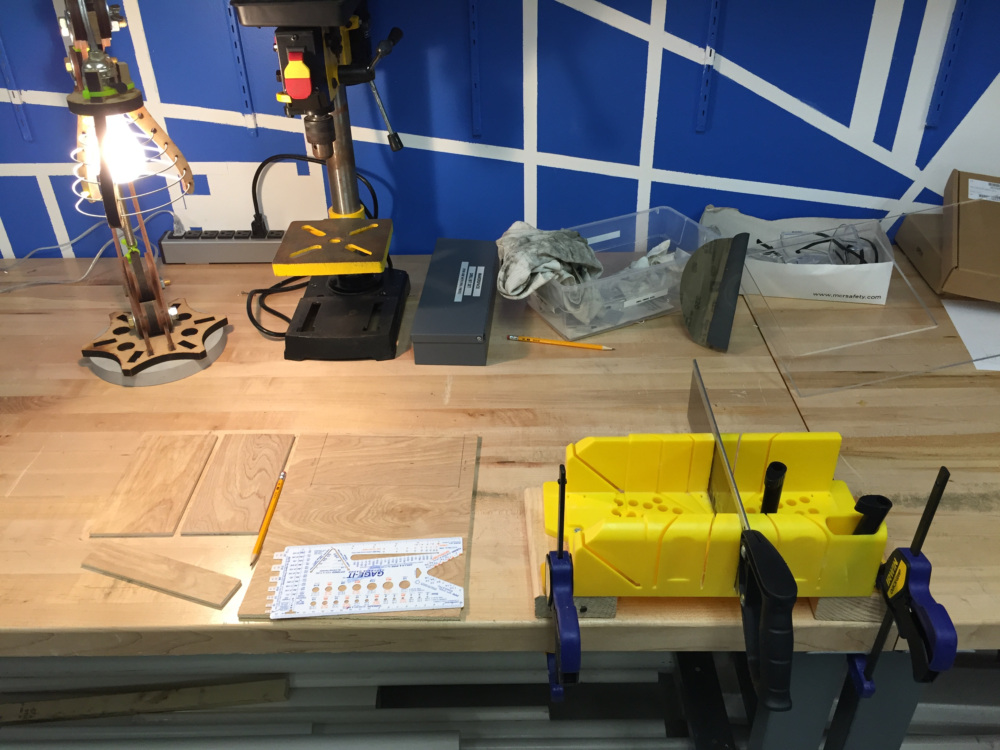
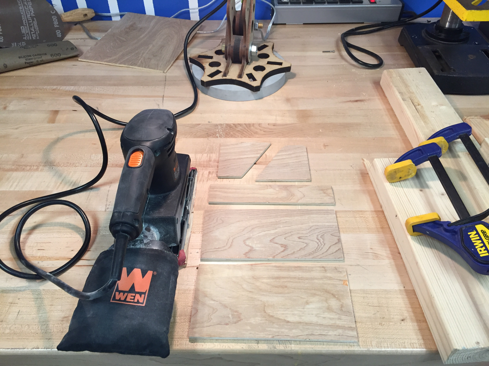
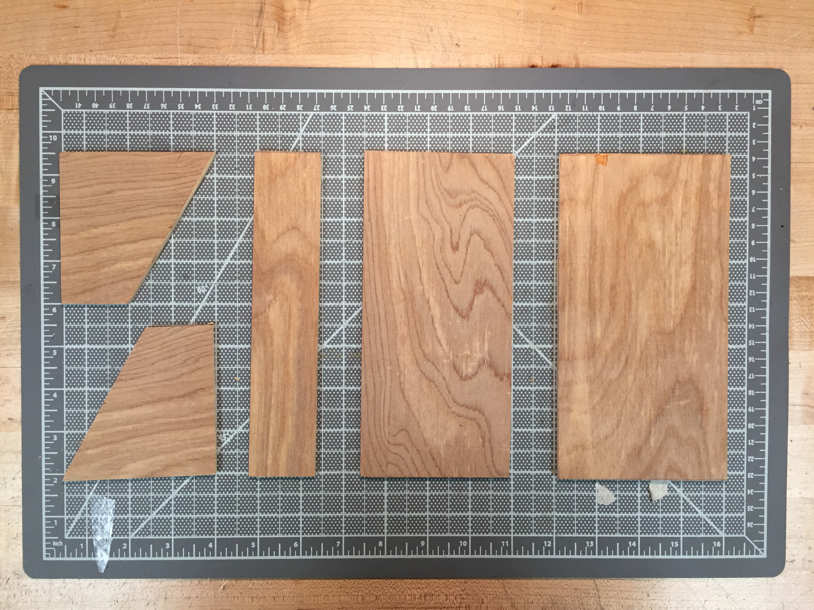
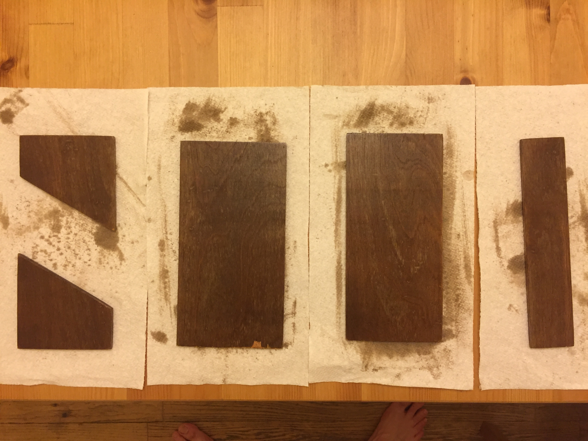
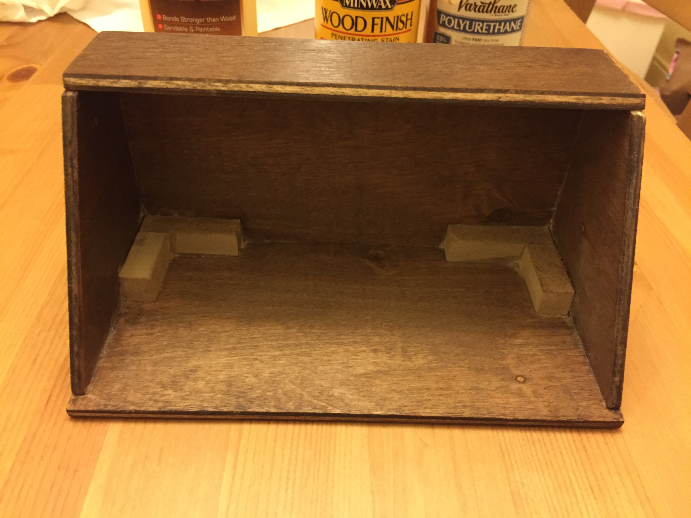
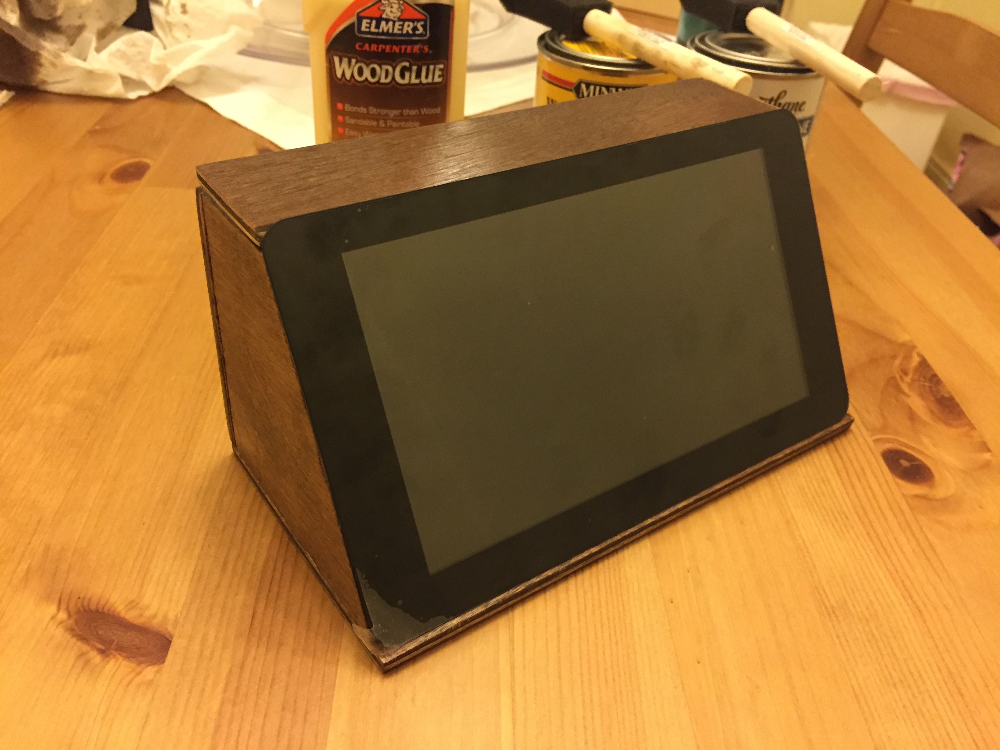
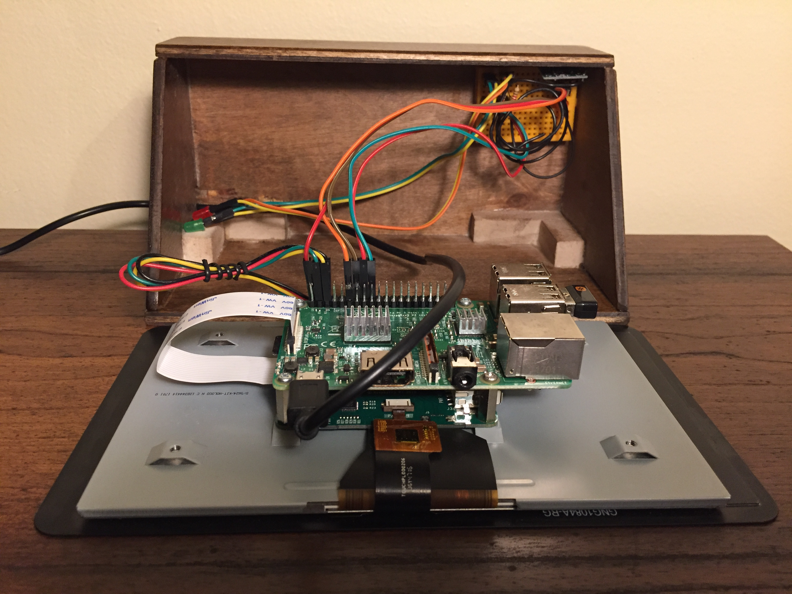
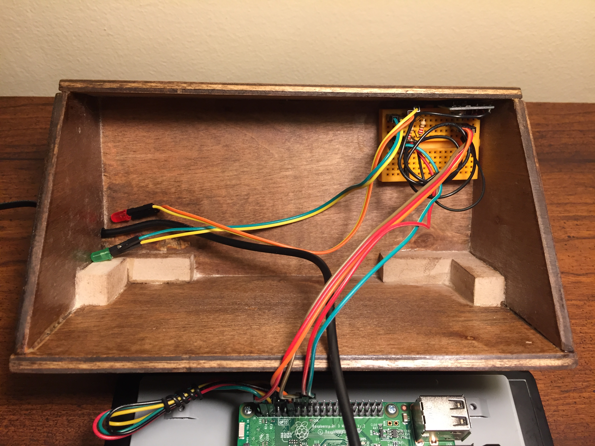

Raspberry PI Control Panel
==========================
Finished product:

<table>
  <tr>
    <th style="text-align:center">Front</th>
    <th style="text-align:center">Back</th></tr>
  <tr>
    <th></th>
    <th></th>
  </tr>
</table>

Design
------
I started with designing the case in [Blender](https://www.blender.org/) to calculate dimensions for the necessary parts. I downloaded a Raspberry PI Touchscreen `stl` file from thingverse and a nice wood material from blendswap.
Here are the dimensions for wood parts:
<p align="center">

</p>

I ended up changing them slightly but these are the approximate values. You can find the blender file in this repo.

Here is the final design:

<p align="center">

</p>

Build
-----
Required parts:
- Raspberry PI 3
- Raspberry PI 7" Touchscreen
- Power source
- 433 MHz RF Transmitter/Receiver
- 433 MHz RF Power Outlets

Case:
- Wood panel (0.5 cm thickness)
- Wood stain, wood glue
- Saw, sandpaper, velcro

Electronics:
- Jumper cables
- Mini breadboard (optional)
- 1 green, 1 red LED (optional)

### Woodworking
I bought a 0.5 cm thick wood panel from Home Depot and used a hand saw to cut it.

#### Saw

<table>
  <tr>
    <th style="text-align:center">Cutting</th>
    <th style="text-align:center">Sanding</th></tr>
  <tr>
    <th></th>
    <th></th>
  </tr>
</table>

#### Stain
Then I used a walnut stain and polyurethane finish.

<table>
  <tr>
    <th style="text-align:center">Before</th>
    <th style="text-align:center">After</th></tr>
  <tr>
    <th></th>
    <th></th>
  </tr>
</table>

#### Glue
I used wood glue to assemble the parts. For the bottom corner I used small wood pieces for support.

<table>
  <tr>
    <th style="text-align:center">Assembled</th>
    <th style="text-align:center">Fitting touchscreen</th></tr>
  <tr>
    <th></th>
    <th></th>
  </tr>
</table>

### Wiring

The wiring is relatively easy for this project. I ended up using two LEDs (one red, one green) to blink when the outlets are turned on and off. The RF outlet control tutorial above has information about the wiring. Here I used a mini breadboard so that I can add other electronics later if I want to.

<table>
  <tr>
    <th style="text-align:center">Wiring</th>
    <th style="text-align:center">Wiring close-up</th></tr>
  <tr>
    <th></th>
    <th></th>
  </tr>
</table>

|No |Part          |Connection|Pin #|GPIO|Bread Board|
|--:|:-------------|---------:|----:|---:|----------:|
|  1|Touchscreen   |        5V|    4|  5V|           |
|  2|Touchscreen   |       GND|    6| GND|           |
|  3|Touchscreen   |       SDA|    3|   2|           |
|  4|Touchscreen   |       SCL|    5|   3|           |
|  5|RF Transmitter|       VCC|    2|  5V|           |
|  6|RF Transmitter|       GND|   14| GND|           |
|  7|RF Transmitter|      DATA|   12|  18|           |
|  8|LED Red       |        5V|   16|  23|           |
|  9|LED Red       |       GND|     | GND|           |
| 10|LED Green     |        5V|   18|  24|           |
| 11|LED Green     |       GND|     | GND|           |


#### Hanging
To hang the control panel to the wall I used Velcro (look at second picture) since the build is quite light and this lets me easily move the panel somewhere else.

Also for the USB cable I cut a small rectangle on the left side since that side was next to the wall in my setup.

### Touchscreen

<p align="center">

</p>

To connect the Raspberry PI 7" Touchscreen look at this guide [here](https://thepihut.com/blogs/raspberry-pi-tutorials/45295044-raspberry-pi-7-touch-screen-assembly-guide).
This makes use of pins on the PI and touchscreen driver.

Altervatively you can use a USB cable to connect touchscreen and PI.

If you need to rotate the touchscreen edit `/boot/config.txt` and add this line: `lcd_rotate=2`.
You need to have `sudo` access to edit the file.
```
sudo nano /boot/config.txt
```
Save and exit by `ctrl + x` and then `y` and `enter`.
Then restart Raspberry PI:
```
sudo reboot
```

Software
--------

### Raspberry PI Setup
[Download the latest NOOBS](https://www.raspberrypi.org/downloads/noobs/), unzip and copy contents to a SD card.

First, update your system's package list by entering the following command:
```
sudo apt-get update
```
Next, upgrade all your installed packages to their latest versions with the command:
```
sudo apt-get dist-upgrade
```


The code is available on my raspberry-pi repository.

### RF Outlet control
To wire and install 433 MHz radio frequency communication with power outlets follow the tutorial [here]((https://kbsezginel.github.io/raspberry-pi/rf-power-outlet)).

### Web Server
Web server tutorial is given [here](https://kbsezginel.github.io/raspberry-pi/web-server).

The scripts can be downloaded by cloning this repository:

```bash
git clone https://github.com/kbsezginel/raspberry-pi.git

cd raspberry-pi/FlaskApp
```
and running:
```
python app.py
```

However, you need to install following dependencies:
```
pip install flask RPi.GPIO
```
Also, you need to install and configure 433 MHz frequency communication as described above. The code table is given in `/FlaskApp/settings.py`. Moreover, the LED pins and blink properties can also be changed from this file.


### External Links
