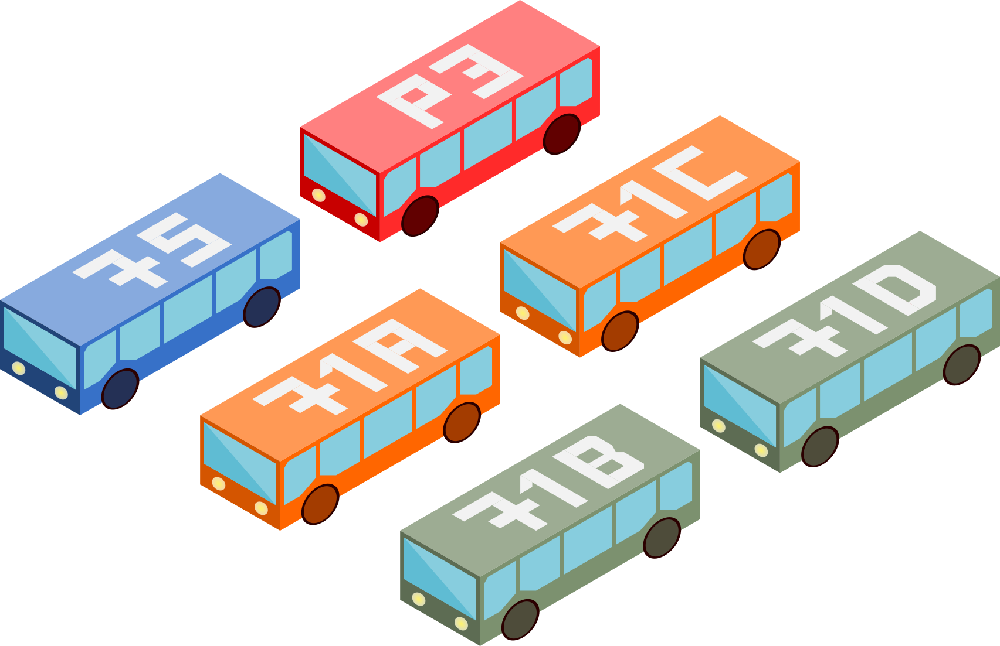

Web Server (Flask)
==================

Using Raspberry PI a web server can be setup to host a site. Using this site Raspberry PI can be controlled to do many things. For example, a home automation site can be set to control lights, outlets and monitor weather, time etc. information.

Installation and Introduction
----------------
**Install Flask by:**
```
pip install flask
```

**For accessing GPIO pins**

Updates and additional installations that might be necessary:
```
sudo apt-get update
sudo apt-get install python-dev
```

- Python 2:
```
sudo apt-get -y install python-rpi.gpio
```

- Python 3:
```
sudo apt-get -y install python3-rpi.gpio
```

**For Pittsburgh, PA live bus schedule ([pghbustime](https://github.com/nhfruchter/pgh-bustime)):**
```
git clone https://github.com/nhfruchter/pgh-bustime.git
cd pghbustime
python setup.py install
```

### Example
Create a python file `app.py` with the following code:
```python
from flask import Flask

app = Flask(__name__)

@app.route('/')
def index():
    return 'Hi!'

if __name__ == '__main__':
    app.run(host='0.0.0.0')
```
Run with `python app.py` to Initialize web server.

Route your browser to `0.0.0.0:50000` to see the message. Alternatively use your IP adress and navigate tp `ip.address:5000` to see the web page. This address should also be accessible to any other device in the same network.


#### Deployment
You can also deploy your web server to access it from anywhere. Check out here:
[Flask Deployment Options](http://flask.pocoo.org/docs/0.10/deploying/#deployment-options)


RPI Web Server
--------------
Here is an example web server that I have been using with my [Raspberry PI control panel](https://kbsezginel.github.io/raspberry-pi/rpi-control-panel).
Currently there is a Home page with time, weather and bus information.
The outlets can be controlled from the RF Outlets page.
LEDs can be controlled from LED page.
Detailed bus schedule information can be seen in Bus page.
Detailed weather information can be seen in weather page.


### Settings
Here are the settings that is used by the RF outlet, LEDs and bus schedule API.
Make sure to change these according to your needs.

### Bus icons
I made some bus icons to be used with the web server and PGH bus time API. These are used to track which bus is coming and the colors are coded according to bus stops. If you are interested I can send the `svg` files I created in Inkscape.

<p align="center">

</p>
